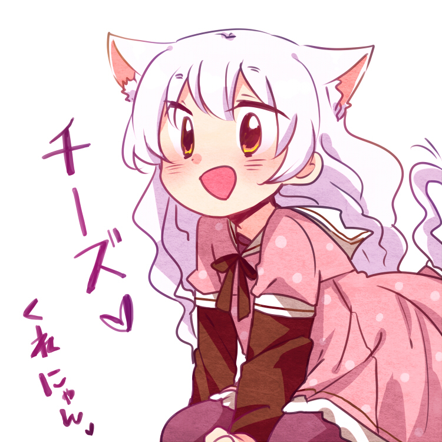

# `.media`

Here you can find rendered images as well as design project files (`*.afdesign` → Affinity Designer project file; `*.afphoto` → Affinity Photo project file) for assets and logos of shinpuru.

Here you can also find the "mascot" of shinpuru, which is also used in the logo and avatars.

It's an artwork form the album [御中元 魔法少女詰め合わせ](https://www.pixiv.net/member_illust.php?mode=medium&illust_id=44692506) made by [瑞希](https://www.pixiv.net/member.php?id=137253). Feel free take a look at their wonderful work. 😉

